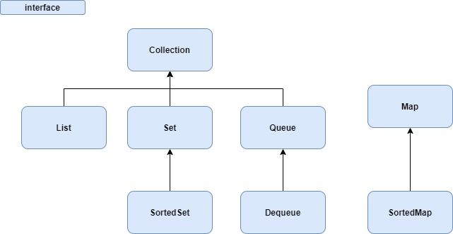

# Collections notes

## Collections hierarchy and methods
* Collections hierarchy\

* Detailed collection hierarchy\

* List hierarchy\

* List methods\

* Set hierarchy\

* Map hierarchy\

* Queue hierarchy\

* Queue methods

* Collections interfaces and their implementatons\

* Dequeue methods\


## Notes
* Collection
	* Container
	* simply an object which groups multiple elements into single unit
* Collection sub interfaces
	* Set, List, Queue, Deque
* Map sub interfaces
	* SortedMap, NavigableMap, ConcurrentMap, ConcurrentNavigableMap
* Some common methods in Collection interface
	* add
	* addAll
	* remove
	* removeAll
	* retainAll
	* contains
	* containsAll
	* clear
	* size
	* isEmpty
* List
	* Order collection
	* allows insertion of null values
	* allows duplicates values
	* can access elements using index
* Set
	* Collection that cannot contain duplicates
	* Allows insertion of one null value
	* we have to override hashCode(), equals() methods to decide duplicate objects. Whenever we are inserting value to set, JVM will check whether this object is equal to any of the existing objects in set. First hashcode() method will be called on two objects. If they return same hashcode then equals() method will be called for those two objects. if equals returns true then new object will be duplicate to existing object, so new object will not be inserted.
* SortedSet
	* Set which maintains its elements in a sorted ascending order.
	* Used for natural ordered sets like word list
* Queue
	* Collection used to hold multiple values prior to processing
	* do not allow insetion of null values
* Deque
	* collection used to hold multiple values prior to processing
	* Unlike queue in deque we can insert, retrieve, remove elements from both ends
* Map
	* collection which maps keys to values
	* allows one null key
	* do not allow duplicate keys
	* allows duplicate values
* SortedMap
	* Map which maintains elements in sorted key order.
	* Used for natural ordered pair like dictionary
* conversion constructor
	* constrcutor in collection implementation classes whose argument is java.util.Collection interface
* Traversing collection
	* Aggregate functions
	* foreach
	* Iterator
* new aggregate functions
	* stream()
	* parallelStream()
* old aggregate functionals
	* addAll()
	* removeAll()
	* containsAll()
	* retainAll()
* differnce between old and new aggregate functions
	* old aggregate functions are mutative(changes underlying collection).
	* New aggregate functions are not mutative
* Iterator
	* Object used to 
		* traverse the collection 
		* remove elements from collection selectively if required
* Set implementations
	* General implementations: TreeSet, HashSet, LinkedHashSet
	* Special purpose implementations: ConcurrentSkipListSet, java.util.concurrent.CopyOnWriteArraySet, java.util.EnumSet
* SortedSet implementation
	* TreeSet
* Whenever we are inserting value to Set, how Set will check whether current object is duplicate or not?
	* * Set will check equality of current object with every object already present in the set. 
	* First hashcode of both the objects (existing and new) will be  checked. If it is same then equals method will be called for these two objects. If equals return true then current object is duplicate of existing object. 
	* If true current object will not be inserted.
* List implementations
	* General implementations: Vector, ArrayList, LinkedList
	* Special purpose implementations: java.util.concurrent.CopyOnWriteArrayList
* Queue implementation
	* PriorityQueue
* Deque implementations
	* ArrayDeque
	* LinkedList
* Map implementations
	* General implemenatitons: HashTable, HashMap, LinkedHashMap, TreeMap
	* Special implemenatitons:  ConcurrentSkipListMap, EnumMap, ConcurrentHashMap, WeakHashMap, IdentityHashMap
* SortedMap implementations
	* TreeMap
* java.util.concurrent.CopyOnWriteArrayList
	* A thread-safe variant of ArrayList in which all mutative operations (add, set, and so on) are implemented by making a fresh copy of the underlying array.
	* This is ordinarily too costly, but may be more efficient than alternatives when traversal operations vastly outnumber mutations, and is useful when you cannot or don't want to synchronize traversals, yet need to preclude interference among concurrent threads. The "snapshot" style iterator method uses a reference to the state of the array at the point that the iterator was created. This array never changes during the lifetime of the iterator, so interference is impossible and the iterator is guaranteed not to throw ConcurrentModificationException. The iterator will not reflect additions, removals, or changes to the list since the iterator was created. Element-changing operations on iterators themselves (remove, set, and add) are not supported. These methods throw UnsupportedOperationException.
	* All elements are permitted, including null.
	* Memory consistency effects
		* As with other concurrent collections, actions in a thread prior to placing an object into a CopyOnWriteArrayList takes care of happen-before actions subsequent to the access or removal of that element from the CopyOnWriteArrayList in another thread
* mutually comparable
	* elements which can be compared each other
* How to convert array as list?
	* This list does not support operations like add, remove, set because unlike normal list the size of this list is fixed and size equal to the number of elements of array.
	* The changes to elements to list will be reflected in underlying array
	* If we perform any add, remove etc operation on this list then java.lang.UpsupportedOperationException will be thrown
```
java.util.Arrays.asList()
````
* how to create synchronized list?
	* java.util.Collections.synchronizedList()
	* Method signature: `public static <T> List<T> synchronizedList(List<T> list);`
	* Example
```
List list = Collections.synchronizedList(new ArrayList());
```
* java.lang.Comparable.compareTo method objects
	* recieving object < specified object ==> negative integer
	* recieving object == specified object ==> zero
	* recieving object > specified object ==> positive integer
```
package java.lang;
public class Comparable<T>{
 public int compareTo(T o);
}
recieving object - o
specified object - on which compareTo is called
```
* java.util.Comparator.compare method objects
	* o1 < o2 ==> return negative value
	* o1 == o2 ==> return zero
	* o1 >  o2 ==> return positive value
```
package java.util;
public class Comparator<T>{
 public int compare(T o1, T o2);
}
```
* Collection new Aggregate functions
	* Streams, pipelines
* Pipelines
	* Sequence of aggregate operations
	* Example
```
roaster.stream().forEach(p -> System.out.println(p.getName()));
```
* Pipeline contains
	* source
	* zero or more intermediate operations
	* terminal operation
* Source
	* This could be a collection, an array, a generator function, or an I/O channel
* zero or more intermediate operations
	* An intermediate operation, such as filter, produces a new stream.
	* stream is a sequence of elements. Unlike a collection, it is not a data structure that stores elements. Instead, a stream carries values from a source through a pipeline. This example creates a stream from the collection roster by invoking the method stream().
	* filter operation returns a new stream that contains elements that match its predicate (this operation's parameter). In this example, the predicate is the lambda expression `e -> e.getGender() == Person.Sex.MALE`. It returns the boolean value `true` if the gender field of object e has the value Person.Sex.MALE. Consequently, the filter operation in this example returns a stream that contains all male members in the collection roster.
```
double average = roster.stream().filter(p -> p.getGender() == Person.Sex.MALE).mapToInt(Person::getAge).average().getAsDouble();
```
* terminal operation
	* A terminal operation, such as forEach, produces a non-stream result, such as a primitive value (like a double value), a collection, or in the case of forEach, no value at all. * In this example, the parameter of the forEach operation is the lambda expression `person -> {System.out.println(person.getName());}` which invokes the method getName on the object person. (The Java runtime and compiler infer that the type of the object person is Person.)
* pre-defined Reduction operations in Java API
	* min
	* max
	* sum
	* count
	* average
* general reduction operations
	* java.util.stream.Stream.reduce(identity, accumulator);
	* java.util.stream.Stream.collect(supplier, accumulator, combiner);
* Stream.redule method\

* Differences Between Aggregate Operations and Iterators
	* Aggregate operations use internal iteration
	* Aggregate operations process elements from a stream
	* Aggregate operations support behavior as parameters
* Aggregate operations use internal iteration
	* Aggregate operations do not contain a method like next to instruct them to process the next element of the collection. 
	* With internal delegation, your application determines what collection it iterates, but the JDK determines how to iterate the collection. 
	* With external iteration, your application determines both what collection it iterates and how to iterate it. 
	* However, external iteration can only iterate over the elements of a collection sequentially. Internal iteration does not have this limitation. 
	* It can more easily take advantage of parallel computing, which involves dividing a problem into subproblems, solving those problems simultaneously, and then combining the results of the solutions to the subproblems.
* Aggregate operations process elements from a stream
	* Aggregate operations process elements from a stream, not directly from a collection. Consequently, they are also called stream operations.
* Aggregate operations support behavior as parameters
	* You can specify lambda expressions as parameters for most aggregate operations. This enables you to customize the behavior of a particular aggregate operation
* Reduction/terminal operations in JDK
	* min, max, sum, count, average
* Reduction/terminal operations return
	* Return one value by combining the contents of a stream. These operations are called reduction operations.
	* The JDK also contains reduction operations that return a collection instead of a single value. Many reduction operations perform a specific task, such as finding the average of values or grouping elements into categories
	* However, the JDK provides you with the general-purpose reduction operations reduce and collect
* Parallelism in Collection framework
	* Parallel computing involves dividing a problem into subproblems, solving those problems simultaneously (in parallel, with each subproblem running in a separate thread), and then combining the results. 
	* Java SE provides the fork/join framework, which enables you to more easily implement parallel computing in your applications. 
	* With fork/join framework, you must specify how the problems are subdivided (partitioned). With aggregate operations, the Java runtime performs this partitioning and combining of solutions for you.
	* One difficulty in implementing parallelism in applications that use collections is that collections are not thread-safe, which means that multiple threads cannot manipulate a collection without introducing thread interference or memory consistency errors. The Collections Framework provides synchronization wrappers, which add automatic synchronization to an arbitrary collection, making it thread-safe. However, synchronization introduces thread contention. You want to avoid thread contention because it prevents threads from running in parallel. Aggregate operations and parallel streams enable you to implement parallelism with non-thread-safe collections provided that you do not modify the collection while you are operating on it.
* parallel grouping based on gender
```
ConcurrentMap<Person.Sex, List<Person>> genderGrouping = persons.parallelStream().collect(Collectors.groupingByConcurrent(Person::getGender));
```
* Above is called a concurrent reduction. The Java runtime performs a concurrent reduction if all of the the following are true for a particular pipeline that contains the collect operation
	* The stream is parallel.
	* The parameter of the collect operation, the collector, has the characteristic Collector.Characteristics.CONCURRENT. To determine the characteristics of a collector, invoke the Collector.characteristics method.
	* Either the stream is unordered, or the collector has the characteristic Collector.Characteristics.UNORDERED. To ensure that the stream is unordered, invoke the BaseStream.unordered operation.
	* This example returns an instance of ConcurrentMap instead of Map and invokes the groupingByConcurrent operation instead of groupingBy. (See the section Concurrent Collections for more information about ConcurrentMap.) Unlike the operation groupingByConcurrent, the operation groupingBy performs poorly with parallel streams. (This is because it operates by merging two maps by key, which is computationally expensive.) Similarly, the operation Collectors.toConcurrentMap performs better with parallel streams than the operation Collectors.toMap.
* java.lang.UnsupportedOperationException
```
Collection<String> collection =  Collections.EMPTY_LIST;
collection.add("1");
```
* The typical I/O operations like reading the text file line by line is a very good candidate to benefit from stream processing. Here is a small example to confirm that
```
final Path path = new File( filename ).toPath();
try( Stream< String > lines = Files.lines( path, StandardCharsets.UTF_8 ) ) {
	lines.onClose( () -> System.out.println("Done!") ).forEach( System.out::println );
}

```

## Examples
* List Examples
	* [ArrayList Examples](src/test/java/com/list/ArrayListPractice.java)
	* [CopyOnWriteArrayList Exampels](src/test/java/com/list/CopyOnWriteArrayListPractice.java)
	* [LinkedList Examples](src/test/java/com/list/LinkedListPractice.java)
* Set Examples
	* [ConcurrentSkipListSetPractice Exmaples](src/test/java/com/set/ConcurrentSkipListSetPractice.java)
	* [CopyOnWriteArraySetPractice Exmaples](src/test/java/com/set/CopyOnWriteArraySetPractice.java)
	* [EnumSetPractice Exmaples](src/test/java/com/set/EnumSetPractice.java)
	* [HashSetPractice Exmaples](src/test/java/com/set/HashSetPractice.java)
	* [LinkedHashSetPractice Exmaples](src/test/java/com/set/LinkedHashSetPractice.java)
	* [TreeSetPractice Exmaples](src/test/java/com/set/TreeSetPractice.java)
* Map Examples
	* [ConcurrentHashMapPractice Examples](src/test/java/com/map/ConcurrentHashMapPractice.java)
	* [ConcurrentSkipListMapPractice Examples](src/test/java/com/map/ConcurrentSkipListMapPractice.java)
	* [EnumMapPractice Examples](src/test/java/com/map/EnumMapPractice.java)
	* [HashMapPractice Examples](src/test/java/com/map/HashMapPractice.java)
	* [IdentityHashMapPractice Examples](src/test/java/com/map/IdentityHashMapPractice.java)
	* [LinkedHashMapPractice Examples](src/test/java/com/map/LinkedHashMapPractice.java)
	* [MapStreamsPractice Examples](src/test/java/com/map/MapStreamsPractice.java)
	* [TreeMapPractice Examples](src/test/java/com/map/TreeMapPractice.java)
	* [WeakHashMapPractice Examples](src/test/java/com/map/WeakHashMapPractice.java)
* Queue Examples
	* [PriorityQueuePractice Examples](src/test/java/com/queue/PriorityQueuePractice.java)
* Dequeue Examples
	* [ArrayDeQueuePractice Examples](src/test/java/com/dequeue/ArrayDeQueuePractice.java)
	