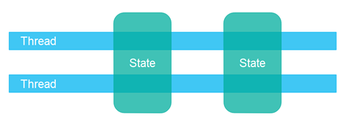
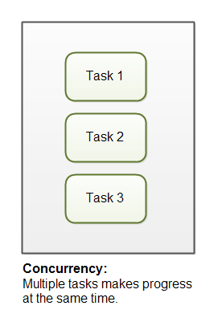
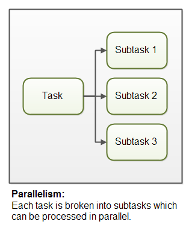

# Multi Threading Notes
* Java Concurrency covers
	* Multi threading
	* Concurrency
	* Parallelism
* What is multi threading?
	* Multithreading means that you have multiple threads of execution inside the same application
	* A thread is like a separate CPU executing your application\

	* A thread is not equal to a CPU though. Usually a single CPU will share its execution time among multiple threads, switching between executing each of the threads for a given amount of time. It is also possible to have the threads of an application be executed by different CPUs\

* Multi tasking
	* process of executing multiple functionalities simultaneously

## Why multi threading
* To avoid cpu ideal state
* Better utilization of a single CPU
* Better utilization of multiple CPUs or CPU cores
* Better user experience with regards to responsiveness
* Better user experience with regards to fairness
### Better utilization of a single CPU
* One of the most common reasons is to be able to better utilize the resources in the computer. For instance, if one thread is waiting for the response to a request sent over the network, then another thread could use the CPU in the meantime to do something else. Additionally, if the computer has multiple CPUs, or if the CPU has multiple execution cores, then multithreading can also help your application utilize these extra CPU cores

### Better utilization of multiple CPUs or CPU cores
* If a computer contains multiple CPUs or the CPU contains multiple execution cores, then you need to use multiple threads for your application to be able to utilize all of the CPUs or CPU cores. A single thread can at most utilize a single CPU, and as I mentioned above, sometimes not even completely utilize a single CPU

### Better User Experience with Regards to Responsiveness
* Another reason to use multithreading is to provide a better user experience. For instance, if you click on a button in a GUI and this results in a request being sent over the network, then it matters which thread performs this request. If you use the same thread that is also updating the GUI, then the user might experience the GUI "hanging" while the GUI thread is waiting for the response for the request. Instead, such a request could be performed by a backgroun thread so the GUI thread is free to respond to other user requests in the meantime

### Better User Experience with Regards to Fairness
* A fourth reason is to share resources of a computer more fairly among users. As example imagine a server that receives requests from clients, and only has one thread to execute these requests. If a client sends a requests that takes a long time to process, then all other client's requests would have to wait until that one request has finished. By having each client's request executed by its own thread then no single task can monopolize the CPU completely

## Multithreading vs. Multitasking
* Back in the old days a computer had a single CPU, and was only capable of executing a single program at a time. Most smaller computers were not really powerful enough to execute multiple programs at the same time

### Multitasking
* Later came multitasking which meant that computers could execute multiple programs (AKA tasks or processes) at the same time. It wasn't really "at the same time" though. The single CPU was shared between the programs. The operating system would switch between the programs running, executing each of them for a little while before switching

### Multithreading
* Later yet came multithreading which mean that you could have multiple threads of execution inside the same program. A thread of execution can be thought of as a CPU executing the program. When you have multiple threads executing the same program, it is like having multiple CPUs execute within the same program

## Multithreading is Hard
* Multithreading can be a great way to increase the performance of some types of programs. However, mulithreading is even more challenging than multitasking. The threads are executing within the same program and are hence reading and writing the same memory simultaneously. This can result in errors not seen in a singlethreaded program. Some of these errors may not be seen on single CPU machines, because two threads never really execute "simultaneously". Modern computers, though, come with multi core CPUs, and even with multiple CPUs too. This means that separate threads can be executed by separate cores or CPUs simultaneously.\

* If a thread reads a memory location while another thread writes to it, what value will the first thread end up reading? The old value? The value written by the second thread? Or a value that is a mix between the two? Or, if two threads are writing to the same memory location simultaneously, what value will be left when they are done? The value written by the first thread? The value written by the second thread? Or a mix of the two values written?
* Without proper precautions any of these outcomes are possible. The behaviour would not even be predictable. The outcome could change from time to time. Therefore it is important as a developer to know how to take the right precautions - meaning learning to control how threads access shared resources like memory, files, databases etc. That is one of the topics this Java concurrency tutorial addresses.

## Concurrency Models
* The first Java concurrency model assumed that multiple threads executing within the same application would also share objects. This type of concurrency model is typically referred to as a `shared state concurrency model`. A lot of the concurrency language constructs and utilities are designed to support this concurrency model.
* The shared state concurrency model causes a lot of concurrency problems which can be hard to solve elegantly. Therefore, an alternative concurrency model referred to as `shared nothing` or `separate state` has gained popularity. In the separate state concurrency model the threads do not share any objects or data. This avoids a lot of the concurrent access problems of the shared state concurrency model.
* New, asynchronous "separate state" platforms and toolkits like Netty, Vert.x and Play / Akka and Qbit have emerged. New non-blocking concurrency algorithms have been published, and new non-blocking tools like the LMax Disrupter have been added to our toolkits. New functional programming parallelism has been introduced with the Fork and Join framework in Java 7, and the collection streams API in Java 8

## Multithreading Benefits
### Better CPU Utilization
* Imagine an application that reads and processes files from the local file system. Lets say that reading af file from disk takes 5 seconds and processing it takes 2 seconds. Processing two files then takes
```
  5 seconds reading file A
  2 seconds processing file A
  5 seconds reading file B
  2 seconds processing file B
-----------------------
 14 seconds total
```
* When reading the file from disk most of the CPU time is spent waiting for the disk to read the data. The CPU is pretty much idle during that time. It could be doing something else. By changing the order of the operations, the CPU could be better utilized. Look at this ordering:
```
  5 seconds reading file A
  5 seconds reading file B + 2 seconds processing file A
  2 seconds processing file B
-----------------------
 12 seconds total
```
* The CPU waits for the first file to be read. Then it starts the read of the second file. While the second file is being read in by the IO components of the computer, the CPU processes the first file. Remember, while waiting for the file to be read from disk, the CPU is mostly idle.
* In general, the CPU can be doing other things while waiting for IO. It doesn't have to be disk IO. It can be network IO as well, or input from a user at the machine. Network and disk IO is often a lot slower than CPU's and memory IO.

### Simpler Program Design
* If you were to program the above ordering of reading and processing by hand in a singlethreaded application, you would have to keep track of both the read and processing state of each file. Instead you can start two threads that each just reads and processes a single file. Each of these threads will be blocked while waiting for the disk to read its file. While waiting, other threads can use the CPU to process the parts of the file they have already read. The result is, that the disk is kept busy at all times, reading from various files into memory. This results in a better utilization of both the disk and the CPU. It is also easier to program, since each thread only has to keep track of a single file

### More Responsive Programs
* Another common goal for turning a singlethreaded application into a multithreaded application is to achieve a more responsive application. Imagine a server application that listens on some port for incoming requests. when a request is received, it handles the request and then goes back to listening. The server loop is sketched below:
```
  while(server is active){
    listen for request
    process request
  }
```
* If the request takes a long time to process, no new clients can send requests to the server for that duration. Only while the server is listening can requests be received.
* An alternate design would be for the listening thread to pass the request to a worker thread, and return to listening immediatedly. The worker thread will process the request and send a reply to the client. This design is sketched below:
``` 
  while(server is active){
    listen for request
    hand request to worker thread
  }
```
* This way the server thread will be back at listening sooner. Thus more clients can send requests to the server. The server has become more responsive
### More Fair Distribution of CPU Resources
* Imagine a server that is receiving requests from clients. Imagine then, that one of the clients sends a request that takes a long time to process - e.g. 10 seconds. If the server processed all tasks using a single thread, then all requests following the request that was slow to process would be forced to wait until the full request has been processed.
* By dividing the CPU time between multiple threads and switching between the threads, then the CPU can share its execution time more fairly between several requests. Then even if one of the requests is slow, other requests that are faster to process can be executed concurrently with the slower request. Of course this means that executing the slow request will be even slower, since it will not have the CPU solely allocated to processing just it. However, the other requests will have to wait shorter time to be processed, because they do not have to wait for the slow tasks to finish before they can be processed. In the event that there is only the slow request to process, then the CPU can still be solely allocated to the slow task

## Multithreading Costs
* Going from a singlethreaded to a multithreaded application doesn't just provide benefits. It also has some costs. Don't just multithread-enable an application just because you can. You should have a good idea that the benefits gained by doing so, are larger than the costs
### More complex design
* Though some parts of a multithreaded applications is simpler than a singlethreaded application, other parts are more complex. Code executed by multiple threads accessing shared data need special attention. Thread interaction is far from always simple. Errors arising from incorrect thread synchronization can be very hard to detect, reproduce and fix.

### Context Switching Overhead
* When a CPU switches from executing one thread to executing another, the CPU needs to save the local data, program pointer etc. of the current thread, and load the local data, program pointer etc. of the next thread to execute. This switch is called a "context switch". The CPU switches from executing in the context of one thread to executing in the context of another.
* Context switching isn't cheap. You don't want to switch between threads more than necessary.
* You can read more about context switching on Wikipedia:
	* http://en.wikipedia.org/wiki/Context_switch

### Increased Resource Consumption
* A thread needs some resources from the computer in order to run. Besides CPU time a thread needs some memory to keep its local stack. It may also take up some resources inside the operating system needed to manage the thread. Try creating a program that creates 100 threads that does nothing but wait, and see how much memory the application takes when running.

## Concurrency Models
### Shared State vs. Separate State
* One important aspect of a concurrency model is, whether the components and threads are designed to share state among the threads, or to have separate state which is never shared among the threads.
* Shared state means that the different threads in the system will share some state among them. By state is meant some data, typically one or more objects or similar. When threads share state, problems like race conditions and deadlock etc. may occur. It depends on how the threads use and access the shared objects, of course.\

* Separate state means that the different threads in the system do not share any state among them. In case the different threads need to communicate, they do so either by exchanging immutable objects among them, or by sending copies of objects (or data) among them. Thus, when no two threads write to the same object (data / state), you can avoid most of the common concurrency problems\

### Parallel Workers
* Incoming jobs are assigned to different workers. Here is a diagram illustrating the parallel worker concurrency model\

* In the parallel worker concurrency model a delegator distributes the incoming jobs to different workers. Each worker completes the full job. The workers work in parallel, running in different threads, and possibly on different CPUs.
* If the parallel worker model was implemented in a car factory, each car would be produced by one worker. The worker would get the specification of the car to build, and would build everything from start to end.
* The parallel worker concurrency model is the most commonly used concurrency model in Java applications (although that is changing). Many of the concurrency utilities in the `java.util.concurrent` Java package are designed for use with this model. You can also see traces of this model in the design of the Java Enterprise Edition application servers
#### Parallel Workers Advantages
* The advantage of the parallel worker concurrency model is that it is easy to understand. To increase the parallelization of the application you just add more workers.
* For instance, if you were implementing a web crawler, you could crawl a certain amount of pages with different numbers of workers and see which number gives the shortest total crawl time (meaning the highest performance). Since web crawling is an IO intensive job you will probably end up with a few threads per CPU / core in your computer. One thread per CPU would be too little, since it would be idle a lot of the time while waiting for data to download.
#### Parallel Workers Disadvantages
* The parallel worker concurrency model has some disadvantages lurking under the simple surface, though. I will explain the most obvious disadvantages in the following sections.
##### Shared State Can Get Complex
* In reality the parallel worker concurrency model is a bit more complex than illustrated above. The shared workers often need access to some kind of shared data, either in memory or in a shared database. The following diagram shows how this complicates the parallel worker concurrency model\

* Some of this shared state is in communication mechanisms like job queues. But some of this shared state is business data, data caches, connection pools to the database etc.
* As soon as shared state sneaks into the parallel worker concurrency model it starts getting complicated. The threads need to access the shared data in a way that makes sure that changes by one thread are visible to the others (pushed to main memory and not just stuck in the CPU cache of the CPU executing the thread). Threads need to avoid race conditions, deadlock and many other shared state concurrency problems.
* Additionally, part of the parallelization is lost when threads are waiting for each other when accessing the shared data structures. Many concurrent data structures are blocking, meaning one or a limited set of threads can access them at any given time. This may lead to contention on these shared data structures. High contention will essentially lead to a degree of serialization of execution of the part of the code that access the shared data structures.
* Modern non-blocking concurrency algorithms may decrease contention and increase performance, but non-blocking algorithms are hard to implement.
* Persistent data structures are another alternative. A persistent data structure always preserves the previous version of itself when modified. Thus, if multiple threads point to the same persistent data structure and one thread modifies it, the modifying thread gets a reference to the new structure. All other threads keep a reference to the old structure which is still unchanged and thus consistent. The Scala programming contains several persistent data structures.
##### Stateless Workers
* Shared state can be modified by other threads in the system. Therefore workers must re-read the state every time it needs it, to make sure it is working on the latest copy. This is true no matter whether the shared state is kept in memory or in an external database. A worker that does not keep state internally (but re-reads it every time it is needed) is called stateless
##### Job Ordering is Nondeterministic
* Another disadvantage of the parallel worker model is that the job execution order is nondeterministic. There is no way to guarantee which jobs are executed first or last. Job A may be given to a worker before job B, yet job B may be executed before job A.
* The nondeterministic nature of the parallel worker model makes it hard to reason about the state of the system at any given point in time
### Assembly Line
* The second concurrency model is what I call the assembly line concurrency model. I chose that name just to fit with the "parallel worker" metaphor from earlier. Other developers use other names (e.g. reactive systems, or event driven systems) depending on the platform / community\

* The workers are organized like workers at an assembly line in a factory. Each worker only performs a part of the full job. When that part is finished the worker forwards the job to the next worker.
* Each worker is running in its own thread, and shares no state with other workers. This is also sometimes referred to as a shared nothing concurrency model.
* Systems using the assembly line concurrency model are usually designed to use non-blocking IO. Non-blocking IO means that when a worker starts an IO operation (e.g. reading a file or data from a network connection) the worker does not wait for the IO call to finish. IO operations are slow, so waiting for IO operations to complete is a waste of CPU time. The CPU could be doing something else in the meanwhile. When the IO operation finishes, the result of the IO operation ( e.g. data read or status of data written) is passed on to another worker.
* With non-blocking IO, the IO operations determine the boundary between workers. A worker does as much as it can until it has to start an IO operation. Then it gives up control over the job. When the IO operation finishes, the next worker in the assembly line continues working on the job, until that too has to start an IO operation etc\

* In reality, the jobs may not flow along a single assembly line. Since most systems can perform more than one job, jobs flows from worker to worker depending on the job that needs to be done. In reality there could be multiple different virtual assembly lines going on at the same time. This is how job flow through assembly line system might look in reality\

* Jobs may even be forwarded to more than one worker for concurrent processing\


## Reactive, Event Driven Systems
* Systems using an assembly line concurrency model are also sometimes called reactive systems, or event driven systems. The system's workers react to events occurring in the system, either received from the outside world or emitted by other workers. Examples of events could be an incoming HTTP request, or that a certain file finished loading into memory etc
* Some of the more popular ones
	* Vert.x
	* Akka
	* Node.JS (JavaScript)
## Actors vs. Channels
### Actors
* Actors and channels are two similar examples of assembly line (or reactive / event driven) models.
* In the actor model each worker is called an actor. Actors can send messages directly to each other. Messages are sent and processed asynchronously. Actors can be used to implement one or more job processing assembly lines, as described earlier\

### Channels
* In the channel model, workers do not communicate directly with each other. Instead they publish their messages (events) on different channels. Other workers can then listen for messages on these channels without the sender knowing who is listening\


### Assembly Line Advantages
* The assembly line concurrency model has several advantages compared to the parallel worker model. I will cover the biggest advantages in the following sections.

#### No Shared State
* The fact that workers share no state with other workers means that they can be implemented without having to think about all the concurrency problems that may arise from concurrent access to shared state. This makes it much easier to implement workers. You implement a worker as if it was the only thread performing that work - essentially a singlethreaded implementation.

#### Stateful Workers
* Since workers know that no other threads modify their data, the workers can be stateful. By stateful I mean that they can keep the data they need to operate in memory, only writing changes back the eventual external storage systems. A stateful worker can therefore often be faster than a stateless worker.

#### Better Hardware Conformity
* Singlethreaded code has the advantage that it often conforms better with how the underlying hardware works. First of all, you can usually create more optimized data structures and algorithms when you can assume the code is executed in single threaded mode.
* singlethreaded stateful workers can cache data in memory as mentioned above. When data is cached in memory there is also a higher probability that this data is also cached in the CPU cache of the CPU executing the thread. This makes accessing cached data even faster.
* I refer to it as hardware conformity when code is written in a way that naturally benefits from how the underlying hardware works. Some developers call this mechanical sympathy. I prefer the term hardware conformity because computers have very few mechanical parts, and the word "sympathy" in this context is used as a metaphor for "matching better" which I believe the word "conform" conveys reasonably well. Anyways, this is nitpicking. Use whatever term you prefer.

#### Job Ordering is Possible
* It is possible to implement a concurrent system according to the assembly line concurrency model in a way that guarantees job ordering. Job ordering makes it much easier to reason about the state of a system at any given point in time. Furthermore, you could write all incoming jobs to a log. This log could then be used to rebuild the state of the system from scratch in case any part of the system fails. The jobs are written to the log in a certain order, and this order becomes the guaranteed job order

### Assembly Line Disadvantages
* The main disadvantage of the assembly line concurrency model is that the execution of a job is often spread out over multiple workers, and thus over multiple classes in your project. Thus it becomes harder to see exactly what code is being executed for a given job.
* It may also be harder to write the code. Worker code is sometimes written as callback handlers. Having code with many nested callback handlers may result in what some developer call callback hell. Callback hell simply means that it gets hard to track what the code is really doing across all the callbacks, as well as making sure that each callback has access to the data it needs

### Functional Parallelism
* The basic idea of functional parallelism is that you implement your program using function calls. Functions can be seen as "agents" or "actors" that send messages to each other, just like in the assembly line concurrency model (AKA reactive or event driven systems). When one function calls another, that is similar to sending a message.
* All parameters passed to the function are copied, so no entity outside the receiving function can manipulate the data. This copying is essential to avoiding race conditions on the shared data. This makes the function execution similar to an atomic operation. Each function call can be executed independently of any other function call.
* When each function call can be executed independently, each function call can be executed on separate CPUs. That means, that an algorithm implemented functionally can be executed in parallel, on multiple CPUs.
* With Java 7 we got the java.util.concurrent package contains the ForkAndJoinPool which can help you implement something similar to functional parallelism. With Java 8 we got parallel streams which can help you parallelize the iteration of large collections. Keep in mind that there are developers who are critical of the ForkAndJoinPool (you can find a link to criticism in my ForkAndJoinPool tutorial).

## Same-threading
### Why Single-threaded Systems?
* You might be wondering why anyone would design single-threaded system today. Single-threaded systems have gained popularity because their concurrency models are much simpler than multi-threaded systems. Single-threaded systems do not share any state (objects / data) with other threads. This enables the single thread to use non-concurrent data structures, and utilize the CPU and CPU caches better.
* Unfortunately, single-threaded systems do not fully utilize modern CPUs. A modern CPU often comes with 2, 4, 6, 8 more cores. Each core functions as an individual CPU. A single-threaded system can only utilize one of the cores\

* In order to utilize all the cores in the CPU, a single-threaded system can be scaled out to utilize the whole computer.
	* One Thread Per CPU
		* Same-threaded systems usually has 1 thread running per CPU in the computer. If a computer contains 4 CPUs, or a CPU with 4 cores, then it would be normal to run 4 instances of the same-threaded system (4 single-threaded systems)\

### Multi threaded vs Same threaded
* A same-threaded system looks similar to a traditional multi-threaded system, since a same-threaded system has multiple threads running inside it. But there is a subtle difference.
* The difference between a same-threaded and a traditional multi-threaded system is that the threads in a same-threaded system do not share state. There is no shared memory which the threads access concurrently. No concurrent data structures\


## Thread Communication
* If the threads in a same-threaded system need to communicate, they do so by message passing. If Thread A wants to send a message to Thread B, Thread A can do so by generating a message (a byte sequence). Thread B can then copy that message (byte sequence) and read it. By copying the message Thread B makes sure that Thread A cannot modify the message while Thread B reads it\


## Concurrency vs. Parallelism
### Concurrency
* Concurrency means that an application is making progress on more than one task at the same time (concurrently). Well, if the computer only has one CPU the application may not make progress on more than one task at exactly the same time, but more than one task is being processed at a time inside the application. It does not completely finish one task before it begins the next. Instead, the CPU switches between the different tasks until the tasks are complete\

### Parallelism
* Parallelism means that an application splits its tasks up into smaller subtasks which can be processed in parallel, for instance on multiple CPUs at the exact same time\


### Details
* As you can see, concurrency is related to how an application handles multiple tasks it works on. An application may process one task at at time (sequentially) or work on multiple tasks at the same time (concurrently).
* Parallelism on the other hand, is related to how an application handles each individual task. An application may process the task serially from start to end, or split the task up into subtasks which can be completed in parallel.
* As you can see, an application can be concurrent, but not parallel. This means that it processes more than one task at the same time, but the thread is only executing on one task at a time. There is no parallel execution of tasks going in parallel threads / CPUs.
* An application can also be parallel but not concurrent. This means that the application only works on one task at a time, and this task is broken down into subtasks which can be processed in parallel. However, each task (+ subtask) is completed before the next task is split up and executed in parallel

## Creating and Starting Java Threads
* Java threads are objects like any other Java objects. Threads are instances of class java.lang.Thread, or instances of subclasses of this class. In addition to being objects, java threads can also execute code
* Creating and Starting Threads
```
Thread thread = new Thread();
```
* To start the Java thread you will call its start() method
```
thread.start();
```
### Thread Subclass
* The first way to specify what code a thread is to run, is to create a subclass of Thread and override the run() method. The run() method is what is executed by the thread after you call start()
```
public class MyThread extends Thread {

	public void run(){
	   System.out.println("MyThread running");
	}
}
```
* To create and start the above thread
```
MyThread myThread = new MyThread();
myTread.start();
```
* We can also create an anonymous subclass of Thread
```
 Thread thread = new Thread(){
    public void run(){
      System.out.println("Thread Running");
    }
  }

  thread.start();
```
### Runnable Interface Implementation
* The Runnable interface is a standard Java Interface that comes with the Java platform. The Runnable interface only has a single method run()
```
public interface Runnable() {

    public void run();

}
```
* Three ways to implement the Runnable interface
	* Create a Java class that implements the Runnable interface
	* Create an anonymous class that implements the Runnable interface
	* Create a Java Lambda that implements the Runnable interface
* Java Class Implements Runnable
```
public class MyRunnable implements Runnable {

    public void run(){
       System.out.println("MyRunnable running");
    }
  }
```
* Anonymous Implementation of Runnable
```
Runnable myRunnable =
    new Runnable(){
        public void run(){
            System.out.println("Runnable running");
        }
    }
```
* Java Lambda Implementation of Runnable
```
Runnable runnable = () -> { System.out.println("Lambda Runnable running"); };
```
* Starting a Thread With a Runnable
```
Runnable runnable = new MyRunnable(); // or an anonymous class, or lambda...

Thread thread = new Thread(runnable);
thread.start();
```
#### Caution - Calling run() Instead of start()
* we may not notice anything because the Runnable's run() method is executed like you expected. However, it is NOT executed by the new thread you just created. Instead the run() method is executed by the thread that created the thread. In other words, the thread that executed the above two lines of code. To have the run() method of the MyRunnable instance called by the new created thread, newThread, you MUST call the newThread.start() method
```
Thread newThread = new Thread(MyRunnable());
newThread.run();  //should be start();
```
### Thread Names
* When you create a Java thread you can give it a name. The name can help you distinguish different threads from each other. For instance, if multiple threads write to System.out it can be handy to see which thread wrote the text
* Sub class of Thread
```
Thread thread = new Thread("Thread Name") {
      public void run(){
        System.out.println("run by: " + getName());
      }
   };


thread.start();
System.out.println(thread.getName());
```
* Implements Runnable
```
MyRunnable runnable = new MyRunnable();
Thread thread = new Thread(runnable, "New Thread");

thread.start();
System.out.println(thread.getName());
```
### Thread.currentThread()
* The Thread.currentThread() method returns a reference to the Thread instance executing currentThread() . This way you can get access to the Java Thread object representing the thread executing a given block of code
```
Thread thread = Thread.currentThread();
```
* Once you have a reference to the Thread object, you can call methods on it. For instance, you can get the name of the thread currently executing
```
String threadName = Thread.currentThread().getName();
```

### Pause a Thread
* A thread can pause itself by calling the static method Thread.sleep() . The sleep() takes a number of milliseconds as parameter. The sleep() method will attempt to sleep that number of milliseconds before resuming execution. The Thread sleep() is not 100% precise
```
try {
    Thread.sleep(10L * 1000L);
} catch (InterruptedException e) {
    e.printStackTrace();
}
```

### Stop a Thread
* Stopping a Java Thread requires some preparation of your thread implementation code. The Java Thread class contains a stop() method, but it is deprecated. The original stop() method would not provide any guarantees about in what state the thread was stopped. That means, that all Java objects the thread had access to during execution would be left in an unknown state. If other threads in your application also has access to the same objects, your application could fail unexpectedly and unpredictably.
* Instead of calling the stop() method you will have to implement your thread code so it can be stopped. Here is an example of a class that implements Runnable which contains an extra method called doStop() which signals to the Runnable to stop. The Runnable will check this signal and stop when it is ready to do so
```
public class MyRunnable implements Runnable {

    private boolean doStop = false;

    public synchronized void doStop() {
        this.doStop = true;
    }

    private synchronized boolean keepRunning() {
        return this.doStop == false;
    }

    @Override
    public void run() {
        while(keepRunning()) {
            // keep doing what this thread should do.
            System.out.println("Running");

            try {
                Thread.sleep(3L * 1000L);
            } catch (InterruptedException e) {
                e.printStackTrace();
            }

        }
    }
}
```
* Notice the doStop() and keepRunning() methods. The doStop() is intended to be called from another thread than the thread executing the MyRunnable's run() method. The keepRunning() method is called internally by the thread executing the MyRunnable's run() method. As long as doStop() has not been called the keepRunning() method will return true - meaning the thread executing the run() method will keep running
* Example of starting a Java thread that executes an instance of the above MyRunnable class, and stopping it again after a delay
```
public class MyRunnableMain {

    public static void main(String[] args) {
        MyRunnable myRunnable = new MyRunnable();

        Thread thread = new Thread(myRunnable);

        thread.start();

        try {
            Thread.sleep(10L * 1000L);
        } catch (InterruptedException e) {
            e.printStackTrace();
        }

        myRunnable.doStop();
    }
}
```
* This example first creates a MyRunnable instance, then passes that instance to a thread and starts the thread. Then the thread executing the main() method (the main thread) sleeps for 10 seconds, and then calls the doStop() method of the MyRunnable instance. This will cause the thread executing the MyRunnable method to stop, because the keepRunning() will return true after doStop() is called.
* Please keep in mind that if your Runnable implementation needs more than just the run() method (e.g. a stop() or pause() method too), then you can no longer create your Runnable implementation with a Java lambda expression. A Java lambda can only implement a single method. Instead you must use a custom class, or a custom interface that extends Runnable which has the extra methods, and which is implemented by an anonymous class

# Multi Threading Bullet Points
* multi tasking types
	* Process based multi tasking
	* Thread based multi tasking
* Process based multi tasking
	* process of executing multiple applications of different technologies simulatenously
* Thread based multi tasking
	* process of executing multiple functionalities of same application simulatenously
* Thread
	* Functionality which can execute simultaneously with other parts of the program.
	* Part of the program under execution. Part of process. Light weight process
* Process
	* program under execution
	* Definition from concurrent programming in java: A process is an operating-system abstraction that allows one computer system to support many units of execution. Each process typically represents a separate running program; for example, an executing JVM. Like the notion of a "computesystem", a "process" is a logical abstraction, not a physical one. So, for example, bindings from processes to CPUs may vary dynamically.
* Scheduling
	* Process of deciding which functionality should execute. 
	* How much time this functionality has to execute. 
	* What functionalty has to execute next. 
	* Scheduling will be done by jvm with the help of local OS. 
	* Definition from concurrent programming in Java: Computations and underlying policies that select which eligible thread to run. These may further interact with other system chores such as processing asynchronous events and garbage collection etc.
* IPC - Inter Process Communication
	* To facilitate the communication between processes operating system support IPC, such as pipes and sockets
	* IPC also supports communication between processes running in different systems.
	* Processes running in same computer system communicates using pipes. 
	* Processes running in different computer systems communicate using sockets. "
* Thread.start()
	* To hand over run() method of java.lang.Runnable interface to jvm to run as an independent task
* multi threading
	* process of defining multiple functionalities as threads and executing multiple threads simultaneously
* suspending thread
	* based on time - `Thread.sleep(100);`
	* based on execution of another thread - `t1.join();`
	* suspend unconditionally to release the lock the current thread acquired - `wait(),notify(), notifyAll()`
	* sleep(), join(), wait() - throws InterruptedException
* Thread safe
	* process of avoiding multiple threads enter common functionality of common object simultaneously. We achive thread safe using synchronized key word
* wait()
	* To release the lock that current thread holding and thread goes to wait state
	* wait() can be called from synchronized block or synchronized method only because intrinsic lock can be acquired while entering into synchronized method or synchronized block and released on exit of synchronized method or synchronized block
* notify()
	* To place a request to jvm to reschedule the thread which has gone to wait state by calling wait() method
* volatile
	* preventing threads caching variable that is changing(from the same thread or by other thread)
