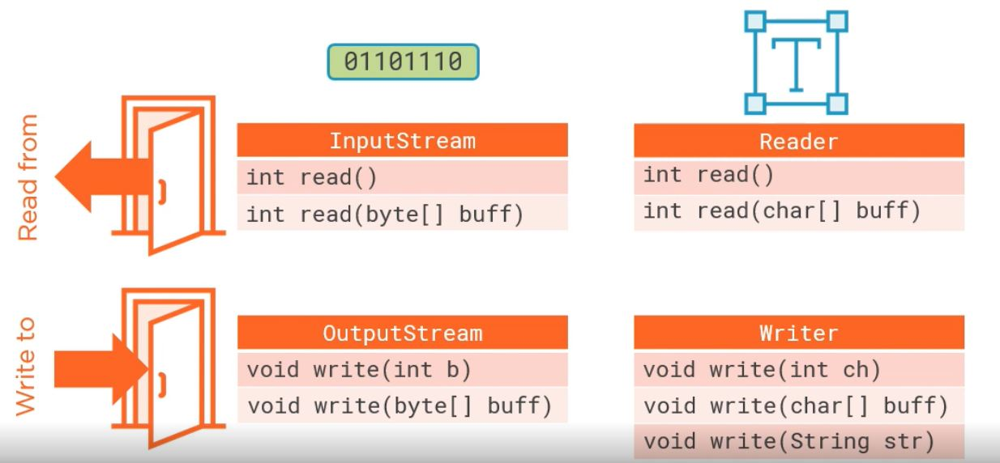
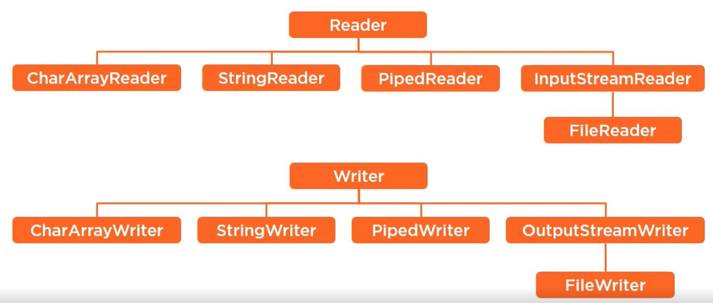
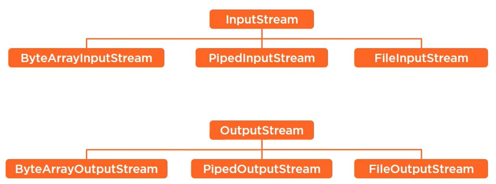

# Core Java Notes
## Basics
* JDK: JRE + Development Kit (tools like compilers(javac) and debuggers (JDB))
* JRE - `Java Runtime Environment`: JVM + Library classes
* Javac: Java Compiler. Generates byte code by converting .java file to .class file
* JVM
	* Virtual machine for Java. Generates machine level language (native language) by converting .class(byte code) to machine level language
	* Software module that provides same execution environment for all java applications and takes care of translation to the underlying layers with regrads to execution instructions and resource management

## Types of Naming Conventions 
* Camel case: If word has more than one word then first letter in first word is small, first letter of sub-sequent words are capital
```
groupId
```
* Spinal case: Each sub word in actual word seperated by hyphon(-)
```
group-id
```
* Upper case: If word has more than one word then first letter in first word is capital, first letter of sub-sequent words are capital 
```
GroupId
```
* All caps: All letters are upper case
```
GROUPID
```

## Naming conventions used in Java
* Upper case
	* Class names
	* Interface names
	* Enum names
* Camel case
	* Variable names
	* Object reference names
	* Method names
	* Arguments
	* Parameters
* All caps
	* Enum values
	* Constants
* All small seperated with dot
	* package names
	
## OOPS concepts
* Encapsulation
* Inheritance
* Polymorphism

### Polymorphism
* process of defining multiple functionalities with the same name with in the same class or sub class
* Types
	* Static polymorphism
	* Dynamic polymorphism
* Static Polymorphism
	* Overloading
* Dynamic Polymorphism
	* Overriding
	
### Inheritance
* Making the properties of one object available to another object
### Encapsulation
* Binding the data with its related functionalities
* Example of encapsulation is `class` where we bind variables and methods
	
## Access specifiers
* public: accessible every where
* private: accessible with in the class
* protected: public with in the same package. Accessible to sub class via inheritance outside the package
* default: accessible with in the same package

## Key words
* Abstraction
	* Hiding the data
	* We achieve abstraction through encapsulation. Without binding the data we don’t have class. Without class and declaring variables as private we can’t hide the data. Hence without encapsulation we can not have abstraction
* super
	* To point the properties of immediate super object of current object
* Early binding: Process of binding the functionality to method at compile time
* Late binding (or) Dynamic binding: Process of binding the functionality to method at run time
	
## Access modifiers
### Class modifiers
* abstract
	* Declared on class, method
	* Declared on class - Object cannot be created
	* Declared on method - to write method without implementation
* final
	* Declared on class, method, variable
	* Declared on class - restricts a class from being inherited
	* Declared on method - cannot override method
	* Declared on values - cannot be reassigned
* strictfp
	* it is related to the checking of floating point values irrespective of OS
* static: 
	* Declared on class, method, variable
	* Declared on method, variable - no object creation required to access
	* non static members can access static members
	* static members cannot access non static members
* transient
	* Declared on variable
	* it is not serialized
* volatile
	* the values are liable for change. More in multi threading
	
## Package
* Group of related classes
* Some java library packages
	* java.lang - default package
	* java.util
* `java.lang` default package
	* It contains classes used by jvm to execute the byte code
	* All classes import `java.lang` package by default

## Class
### Definitions
* Fully implemented Structure
* User defined data type
* Blue print for creating an object
* Prototype for creating an object
* Definition
	* Fully implemented user defined data-structure which acts as a blue print for creating an object
### Declare class
* Allowed access specifiers for class
	* public
	* nothing means default
```
public class Student{
	private int id;
	private String name;
	private double grade;
}
```
```
class Employee{
	private long id;
	private String name;
	private Date joiningDate;
}
```
### Final class
* Class with `final` access modifier
```
public final class Student{

}
```

## Object
* `Instance`: Any dynamic memory allocation
* `Object`: instance of a class
* Create object using `new` keyword
* `new`
	* Loads the class to JVM
	* Executes static initializers
	* Initialize static fields declared in class (remember static final fields will be initialized at compile time)
	* Allocates memory for non static members of the class
	* Loads non static members of the class. Initializes non static members of the class
	* Executes constructor
* Create object
```
Student studentReference = new Student();
```
* In the above declaration
	* `new Student()` : object
	* `studentReference`: reference variable
	* `Student`: reference type

## Constructor
* Functionality which gets executed automatically by jvm at the time of creating an object
* No return type
* Same name as class
### Zero argument constructor
* Default constructor
* Zero argument constructor provided by java compiler at the time of compilation if class does not define any constructor
* Class with zero argument `public` constructor
```
public class Student{
	
	public Student(){
		// logic
	}
}
```
* Class with zero argument `private` constructor
	* Cannot create object out side of class
	* Cannot have sub class. we can not extend class having private constructor
```
public class Student{
	
	private Student(){
		// logic
	}
}
```
### Argumented constructor
* Class with more than one arguments in constructor
```
public class Student{

	private String name;
	private String course;
	
	public Student(){
		// logic
	}
	
	public Student(String studentName){
		this.name = studentName;
	}
	
	public Student(String studentName, String studentCourse){
		this.name = studentName;
		this.course = studentCourse;
	}

}
```

## Variables
### Instance variables
* Variables declared inside class
* non static members of class
* Not declared as static
```
public class Student{
	
	// instance variables
	private String name;
	private String course;
	
}
```
### Static variables
* static members of class
* Variables declared inside class with `static` access modifier
* Also called class variables
```
public class Student{
	private static int MIN_AGE = 5;
}
```

## Methods
* Method will have
	* Access specifier
	* Return type
	* Method name
	* Arguments
* Declared inside class
```
public class Student{
	
	public String getName(String name){
		return name;
	}
 
}
```

## Nested class
* Static nested classes
* non-static nested classes (or) inner classes
### Inner classes
* Local Inner classes (Local classes)
	* classes declared with in a method
	* classes declared with in a block
* Anonymous inner classes
	* classes declared with in a method without a name.
	* we can declare static final variables in anonymous inner classes.
	* we cannot declare static variables/methods in anonymous inner classes.

### Abstract class
* Partially implemented and partially unimplemented structure
* Class with `abstract` access modifier
* Cannot create object of class
* class can be declared as abstract though class does not have abstract method (method without implementation)
* If class have abstract method it must be declared abstract
```
public abstract class Person{
	public String getName(){
		return "Jack";
	}
}
```
```
public abstract class Person{
	
	public abstract String getDesignation();
	
	public abstract double getGrade();
	
}
```
* class extends abstract class must implement all abstract methods else it also must be declared abstract
	* Don't declare `abstract` access modifier to method while writing implementation
```
public class Student extends Person{
	
	public String getDesignation(){
		return null;
	}
	
	public double getGrade(){
		return 3.45;
	}
}
```

## Interface
### Definition
* Fully unimplemented structure
* Until Java 8 interface can have
	* Abstract methods (methods without implementation)
	* Constants (public static final variables)
* From Java 8 interface can have
	* Abstract methods
	* Constants
	* static methods (methods declared with default keyword)
	* default methods (methods declared with static keyword)
* Declare interface
```
public interface InterfaceWithMethod {
	// abstract method
	public void test();
	
	// default method
	public default void test2(){
		System.out.println("Hello World"); 
	}
	
	// static method
	public static void test3(){ 
		System.out.println("test()");
	}
}

public class InterfaceWithMethodImpl implements InterfaceWithMethod {

	@Override
	public void test() {
		System.out.println("test().....");
	}
	
	public static void main(String[] args) {
	   InterfaceWithMethodImpl obj = new InterfaceWithMethodImpl();
	   obj.test(); 
	   obj.test2(); // access default methods using object
	   InterfaceWithDefaultMethod.super.method1(); // access default methods using interface name from implemented class
	   InterfaceWithMethod.test3();
	}
	
}
```
* Dis advantages of interfaces
	* If n classes are implementing an interface then if we need common functionality to be available to all classes then we need either write that in one abstract class and all other classes have to extend that class or we need to implement that method in all classes. 
	* This issue solved in JDK 8 by providing default methods in interfaces
* Examples
	* [InterfacesPractice.java](basics/src/test/java/com/interfaces/InterfacesPractice.java)

## Primitive data types
* int
* float
* double
* char

## Wrapper classes
* Converting primitives to objects and vice versa
* Types
	* Boxing
	* Unboxing
	* Autoboxing
	* Autounboxing
* Boxing
	* Converting primitives to objects
* Unboxing
	* Converting objects to primitive data types
* Autoboxing	
	* Automatic conversion of primitives to objects
* Autounboxing
	* Automatic conversion of objects to primitives
* Some wrapper classes
	* Integer
	* Float
	* Double
	* Character

## Type Casting
* process of converting the value of one data type to its equivalent value of another data type
* Types of type casting
	* Implicit type casting
	* Explicit type casting
* Implicit type casting
	* if jvm do the type casting automatically
* Explicit type casting
	* if jvm do the type casting with our specification

## String
* class in `java.lang` package
* Refer [strings-practice](strings-practice)

### StringBuffer
* All methods are `synchronized`

### StringBuilder
* All methods are `non synchronized`

### StringJoiner
* StringJoiner is used to construct  
	* Sequence of characters separated by a delimiter 
	* Optionally starting with a supplied prefix and ending with a supplied suffix

## Arrays
* Group of same data type values
* Fixed size
* Index start with `0` - zero
* Refer array examples - [ArraysPractice.java](collections/src/test/java/com/util/ArraysPractice.java)

## Loops
* while loop
```
int i=0;
while(i <= 10){
	// logic
	i++;
}
```
* do while loop
```
int i=0;
do{
	// logic
	i++;
}while(i <=10);
```
* for loop
```
for(int i=0;i<10;i++){
	// logic
}
```
* for each loop
```
for(int i: list){
	// logic
}
```

## Exception Handling
* Exception: Exception is an event, which occurs during the execution of a program, that disrupts normal flow of program's instructions
* Resource: An object that must be closed after the program is finished with it
* Types of exceptions
	* CheckedExceptions
		* Exception classes which extends java.lang.Exception class
		* These execeptions must be handled with try-catch or throws
	* UncheckedExceptions/runtime exceptions
		* Exception classes which extends java.lang.RuntimeException class
		* We should avoid getting these exceptions
	* Error
		* classes which extends java.lang.Error class
		* Example: java.lang.NoClassDefFoundError, java.io.IOError
* try-with-resource statement
	* try-with-resource statement ensures the each resource is closed at the end of the statetement regardless of whether the try statement completes normally or abruptly
	* Any object which implements java.lang.AutoCloseable or java.io.Closeable can be used as resource
	* Interface java.io.Closeable extends java.lang.AutoCloseable
* throws
	* To remind the compiler that the method can throw an exception
* throw
	* Creates an exception object and throws it
* Advantages of exception
	* Seperates error handling code from regular code
	* Propogating errors up to the call stack
	* Grouping and differentiating error types
* try block
	* identifies the code in which exception can occur
* catch block
	* block of code known as exception handler
* finally
	* block of code that guarantees to execute
* Examples
	* [TryWithResource.java](basics/src/test/java/com/exception/TryWithResource.java)

## References
* Different classes in java.lan.ref package
	* Reference<T>
	* WeakReference<T> extends Reference<T>
	* SoftReference<T> extends Reference<T>
	* PhantomReference<T> extends Reference<T>
	* ReferenceQueue<T> extends Object
* Types of reference variables in Java
	* Strong reference
	* Weak reference
	* Soft reference
	* Phantom reference

### Strong reference
* Create strong reference
```
String s = "abc";
```

### Weak reference
* object is eligible for garbage collection when strong reference is set to null
* Creating java.lang.ref.WeakReference
```
Counter counter = new Counter(); // strong reference
WeakReference<Counter> weakCounter = new WeakReference<Counter>(counter);//weak reference
counter = null; // now Counter object is eligible for garbage collection
```
* Example
	* One convenient example of WeakReference is WeakHashMap, which is another implementation of Map interface like HashMap or TreeMap but with one unique feature. WeakHashMap wraps keys as WeakReference which means once strong reference to actual object removed, WeakReference present internally on WeakHashMap doesn't prevent them from being Garbage collected

### Soft reference
* object is eligible for garbage collection but only be collected when JVM absolutely needs memory
* Creating java.lang.ref.SoftReference
```
Counter prime = new Counter(); // prime holds a strong reference
SoftReference<Counter> soft = new SoftReference<Counter>(prime) ; //soft has SoftReference to Counter Object created
prime = null; // now Counter object is eligible for garbage collection but only be collected when JVM absolutely needs memory
```
* WeakReference vs SoftReference
	* Garbage collector can collect an object if only weak references are pointing towards it and they are eagerly collected, on the other hand Objects with SoftReference are collected when JVM absolutely needs memory

### PhantomReference
* Phantom reference is third kind of reference type available in java.lang.ref package. Phantom reference is represented by java.lang.ref.PhantomReference class. Object which only has Phantom reference pointing them can be collected whenever Garbage Collector likes it
* Create PhantomReference
```
DigitalCounter digit = new DigitalCounter(); // digit reference variable has strong reference
PhantomReference<DigitalCounter> phantom = new PhantomReference<DigitalCounter>(digit, referenceQueue);
```

### java.lang.ref.ReferenceQueue
* one more class called ReferenceQueue which is worth knowing. You can supply a ReferenceQueue instance while creating any WeakReference, SoftReference or PhantomReference as shown in following code
```
ReferenceQueue refQueue = new ReferenceQueue(); //reference will be stored in this queue for cleanup
DigitalCounter digit = new DigitalCounter();
PhantomReference<DigitalCounter> phantom = new PhantomReference<DigitalCounter>(digit, refQueue);
```
* Reference of instance will be appended to ReferenceQueue and you can use it to perform any clean-up by polling ReferenceQueue

### Examples
	* [ReferencesPractice.java](basics/src/test/java/com/references/ReferencesPractice.java)
	
## Annotations
* Refer [Annotation Notes](annotations/notes.md)

## File IO
* stream: continuous flow
* IO Stream: continuous flow of data
* 2 categories in io streams
	* Byte Streams - Interacts as bindary data
	* Text Streams - Interacts as unicode characters
* Base class to read binary data
	* InputStream
* Base class to read text data
	* Reader
* Read individual byte
	* End of the stream means read() method returns -1
```
int output = InputStream.read()
```
* Read individual character
	* End of the characters means read() method returns -1
```
int numberOfCharactersRead = Reader.read()
```
* read all bytes that fits into byte array
```
InputStream.read(byte[] data)
```
* read all characters that fits into char array
```
Reader.read(char[] data)
```
* Common Stream interfaces
	* InputStream
	* OutputStream
* InputStream implementation classes
	* FileInputStream
	* ByteArrayInputStream
	* PipedInputStream
* OutputStream implementation classes
	* FileOutputStream
	* ByteArrayOutputStream
	* PipedOutputStream
* Common character based stream interfaces
	* Reader
	* Writer
* Reader implementations
	* InputStreamReader
		* FileReader
	* StringReader
	* CharArrayReader
	* PipedReader
* Writer implementations
	* OutputStreamWriter
		* FileWriter
	* StringWriter
	* CharArrayWriter
	* PipedWriter
* line break in unix - `\n`
* line break in windows - ` \r\n`
* BufferedReader
	* Read file content
	* Will read lines based on new line character of underlying OS
* BufferedWriter
	* To write content to file
	* newLine() - adds new line character based on underlying OSnewLine() - adds new line character based on underlying OS
* Basic Stream \

* Reader classes hierarchy \

* Stream classes hierarchy \
